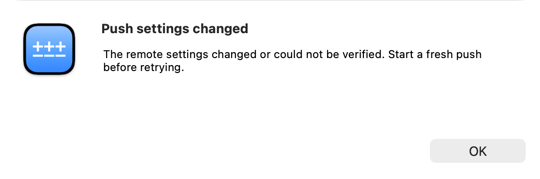
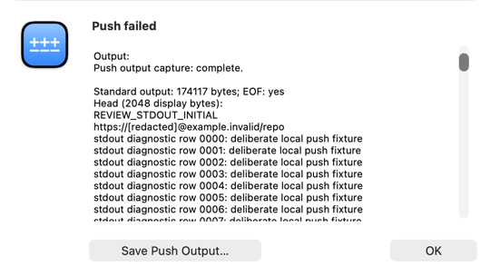
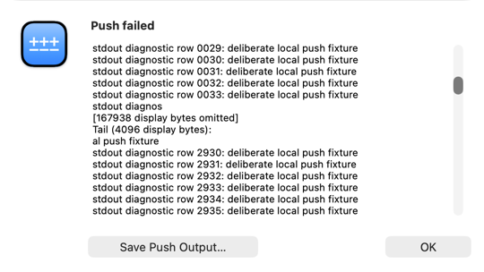
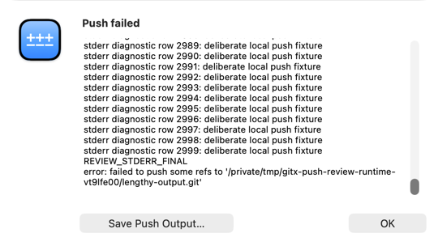
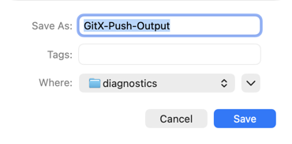

# Push safety and diagnostics verification

Production source `cee604df671413b2dd8053c7798365f0fbbf0428` passed the canonical correctness, UI, sanitizer, performance and analysis gates. The final documentation/coverage commit adds these diagnostic attachments and only raises demonstrated coverage floors. Delivery refreshes the same verified production source into `/Volumes/ExtStor/gitx/build/GitX.app`; the PR records its final build receipt.

| Verification | Result |
|---|---|
| Correctness and checked-in coverage floors | 1,515 passed, zero failures/skips; every floor passes |
| UI activation preflight / full UI | 1 / 39 passed, zero failures/skips |
| Address / Undefined sanitizer | 1,515 passed, zero failures/skips |
| Thread Sanitizer | 1,515 passed, zero failures/skips |
| Performance | 23 passed, zero failures/skips |
| Static verification | 261 script tests passed; header, boundary, formatting, resource and CI checks passed |
| Native analysis / pinned Swift analysis | Zero native warnings/findings; 242 Swift files, zero violations |
| Pinned tools | SwiftLint 0.63.2; SwiftFormat 0.62.1, through repository scripts |
| Runtime | Settings-change rejection, bounded summary, native Save cancel/reopen/export passed |

Fresh base app coverage was **92.00%**; final app coverage is **92.20%**. `RepositoryRemoteService.swift` reaches **96.52%**, and `PBTaskDiagnosticCapture.swift` **97.63%**. Affected PBTask and message-sheet implementations had **100%** line coverage before focused Swift extraction. Final floors rise for the app, diagnostic presenters, HistoryList and RevisionList. The process-owner floor remains at its checked-in 99.30% because the automatic higher proposal contains a wrapped closing-brace instrumentation counter. No existing floor is lowered. See [verification.json](verification.json) for run IDs, source heads, dirty fingerprints and measurements.

The complete [review reconciliation](REVIEW.md) accounts for all 33 pasted comments with dispositions, implementing commits and named test evidence. Broad KVC, repeated-loop and Working State cleanup and the truncated copy-layering claim remain deferred; the demonstrated avatar startup observation failure is repaired separately. The real replacement/graft safety regression fails when its guards are removed, and passes with the shipped runner's guards restored. No failing tests were committed. No package production code changed.

## Current diagnostic screenshots

These are unedited diagnostic captures, without pixel comparison assertions. Native attached sheets were captured by observed window IDs belonging to the canonical harness's exact recorded process. Capture hashes and process/window identities are in [runtime.json](runtime.json); automated attachments retain their separate correctness/UI receipts.

**Push settings changed:**

**Complete capture, redacted head and export action:**

**Explicit omission and retained tail:**

**Final stderr bytes:**

**Native Save panel, reopened after cancellation:**

Additional automated attachments: [settings-changed UI journey](ui-settings-changed.png), [incomplete-capture/error/export controls](xctest-output-summary.png).

## Runtime evidence and limits

The two disposable repositories use local bare remotes. Settings drift prevented retry before launching the changed receive-pack command. The intentionally rejected hook push produced stdout 174,117 bytes and stderr 174,220 bytes, both complete through EOF. The bounded sheet labelled 167,938 and 168,041 omitted display bytes. The native save flow cancelled once, reopened, exported 348,438 redacted bytes with all 3,000 numbered rows and initial/final markers from each stream, and restored the export control. Source, tracking and bare refs remained unchanged; both working trees stayed clean. See [RUNTIME.md](RUNTIME.md) and [runtime.json](runtime.json) for full provenance, export hash and log observations.

Optional recovery fails closed for unsupported capabilities, ambiguous/excluded mappings, invalid objects, incomplete status or unproven bounded/shallow history. Ordinary legacy-Git pushes remain available. A push timeout means remote completion is unknown and cannot offer automatic force recovery. Capture/export failure does not change the Git result and explicitly reports incompleteness; no unsafe raw tail is substituted. URL-userinfo redaction conservatively masks ambiguous authorities and is not an arbitrary-secret detector. Reports preserve separate streams without promising cross-stream chronology. Export is atomic and preserves an existing destination on failure.

The first short-lived runtime attempt exited when its supervising exec session ended, before any push. Its logs are preserved; an owned persistent supervising session enabled both successful canonical runs without changing the launcher. Successful sessions were stopped through the harness. Unrelated untracked files, PR74's branch, recovery sources and backups are preserved.
